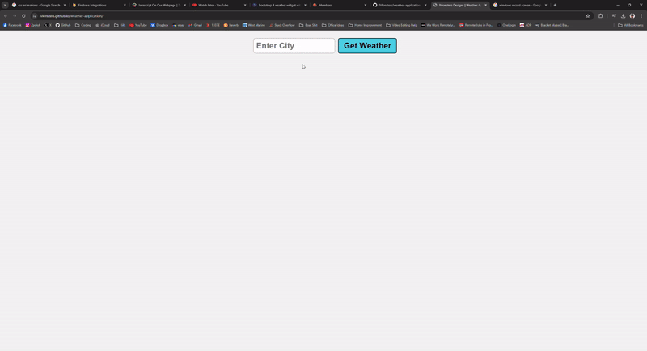
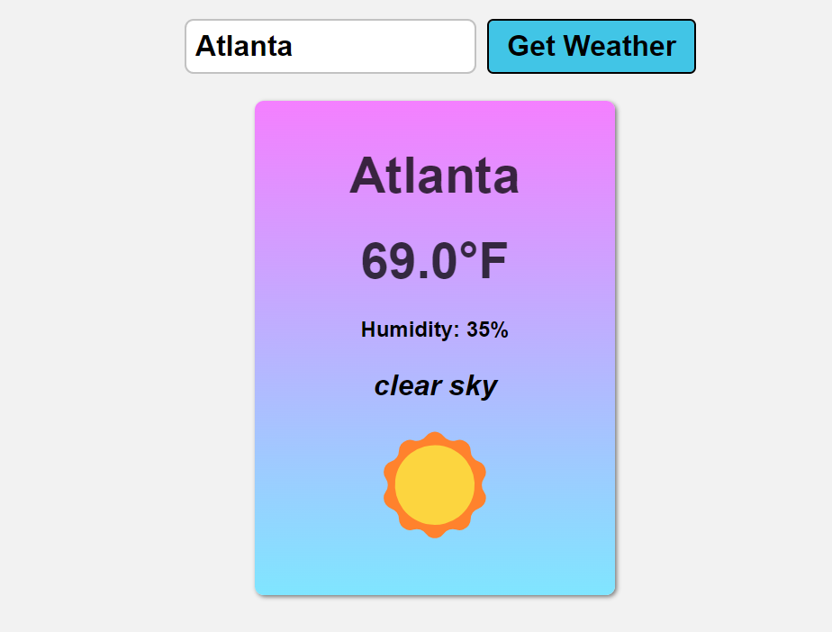

# PROJECT REPO TITLE HERE

## Table of Contents

* [Description](#description)
* [Languages](#languages)
* [Features](#features)
* [Usage](#usage)
* [Credits](#credits)
* [License](#license)  

## Description
    Basic weather application to local weather at any given location    
## Languages

* 
* 
* 

## Features

* **Global Search Functionality:** Search will recognize any known location world wide.
* **Reach Weather Button:** Weather search button changes color and border on hover, responds to click and enter key.
* **Reactive Text:** all displayed data is reactive to hover. Color Changes, more to come in future 
* **Weather Emoji:** Weather emoji is set to change based on weather ID response from API 
* **API Integration:** Weather API integrated for real time data across the globe.
* **Javascript Weather Degree Conversion :** Weather correctly converted to fahrenheit in JavaScript.

## Usage

* Type in any location globally you would like to know the current weather temperature, humidity, and conditions.
    Click Get Weather or simply hit enter and weather information will render on screen.

* [LIVE Web link](https://ivionsters.github.io/weather-application/)

* [IVIonsters Designs Repo Link](https://github.com/IVIonsters/weather-application)

* 
* 

## Credits

* [N/A](N/A)

## License

